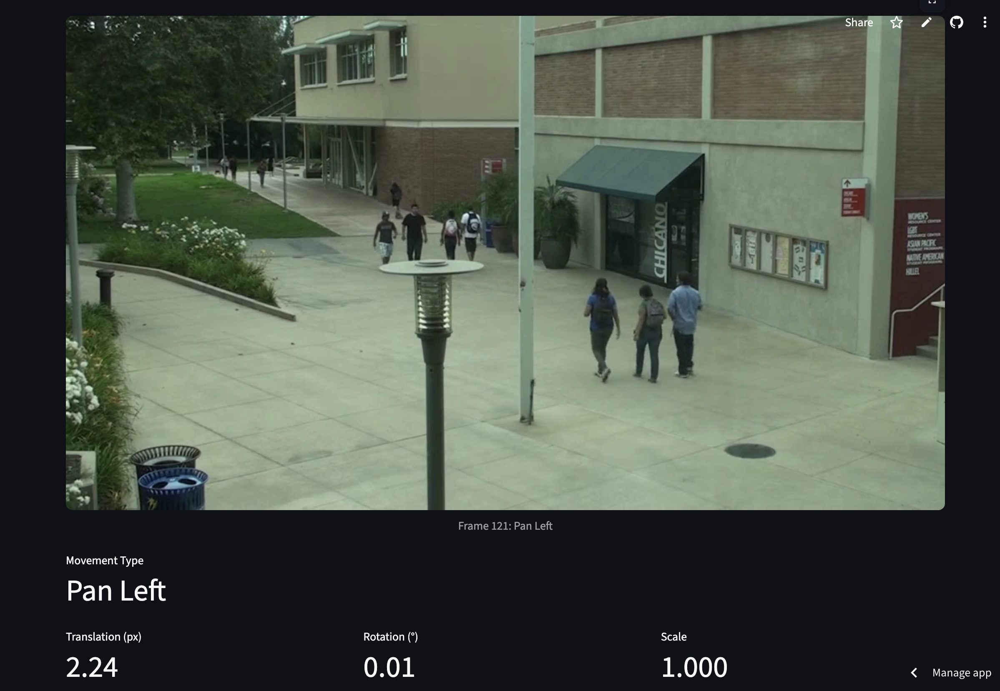
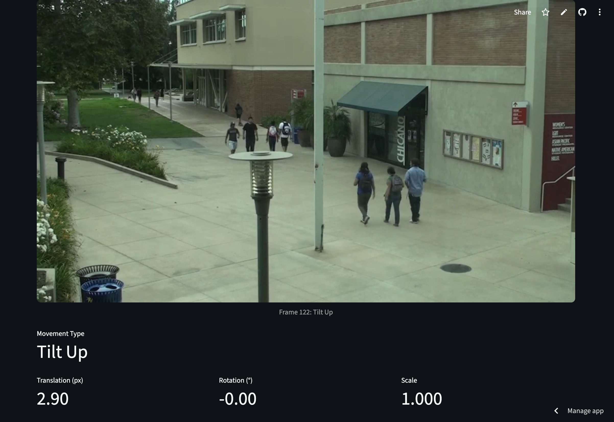

# Advanced Camera Movement Detection

This project provides a senior-level solution for detecting and classifying significant camera movements (panning, tilting, rotation, and zooming) in a video. It uses a robust computer vision pipeline to distinguish between camera-induced motion and object movement within the scene, offering high accuracy and detailed feedback.

The application is built with Python, OpenCV, and Streamlit, featuring a re-architected algorithm for professional use cases.

## 🤖 Technical Approach: A Senior-Level Pipeline

The algorithm was re-engineered from a basic proof-of-concept to a robust, multi-stage pipeline that delivers higher accuracy and more insightful results.

1.  **Optimized Feature Detection**: The pipeline uses **ORB (Oriented FAST and Rotated BRIEF)** with an increased feature count (`nfeatures=2000`) to ensure a rich set of keypoints is available for matching, even in low-texture areas.

2.  **Robust Homography Estimation**: A **FLANN-based matcher** with a strict ratio test identifies high-quality corresponding points between consecutive frames. These points are used to compute a **homography matrix** via the **RANSAC** algorithm, which is resilient to outliers.

3.  **Homography Decomposition & Motion Analysis**: Instead of a superficial check, the homography matrix is **decomposed** to precisely quantify different motion types:
    *   **Translation**: Calculated from the matrix's `tx` and `ty` components to measure panning and tilting.
    *   **Rotation**: Extracted by analyzing the rotation components of the matrix to measure degrees of rotation.
    *   **Scale (Zoom)**: Determined by analyzing the change in scale from the matrix, identifying camera zoom-in or zoom-out events.

4.  **Temporal Smoothing for Noise Reduction**: This is the key to achieving high accuracy. Motion metrics are not evaluated on a frame-by-frame basis, which is prone to noise. Instead, they are averaged over a **configurable sliding window** (e.g., 3-5 frames). A movement is only flagged if the *average* motion in this window exceeds the thresholds, effectively eliminating false positives from single-frame glitches or insignificant jitter.

5.  **Intelligent Movement Classification**: Based on the smoothed metrics, the algorithm classifies the movement into clear categories (`Pan/Tilt`, `Rotation`, `Zoom`, or a combination) and returns a detailed report.

## 🚀 Getting Started

### Prerequisites

*   Python 3.8+
*   A virtual environment (strongly recommended).

### Installation

1.  **Clone the repository:**
    ```bash
    git clone https://github.com/batuhgursoy/camera-movement-detection.git
    cd camera-movement-detection
    ```

2.  **Create and activate a virtual environment:**
    ```bash
    python3 -m venv venv
    source venv/bin/activate
    ```

3.  **Install the dependencies:**
    ```bash
    pip install -r camera-movement-detection/requirements.txt
    ```

### Running the App

1.  **Run the Streamlit app:**
    ```bash
    streamlit run camera-movement-detection/app.py
    ```

2.  **Open your browser** to the URL displayed in the terminal (usually `http://localhost:8501`).

3.  **Upload a video file** and use the advanced controls to fine-tune the detection.

## ⚙️ Advanced Controls

The app provides fine-grained control over the detection algorithm:

*   **Translation Threshold**: Sensitivity to panning/tilting.
*   **Rotation Threshold**: Sensitivity to rotation.
*   **Scale/Zoom Threshold**: Sensitivity to zooming.
*   **Temporal Smoothing Window**: The number of frames to average motion over. Higher values provide more stability and fewer false positives but are less sensitive to very short movements.

## Sample Output

The application provides a detailed, frame-by-frame report for each detected movement instance, distinguishing between smooth pans and rapid shakes.

| Smooth Pan Detection | Rapid Shake/Jitter Detection |
| :---: | :---: |
|  |  |

*(You can add a new screenshot of the advanced UI here.)*
